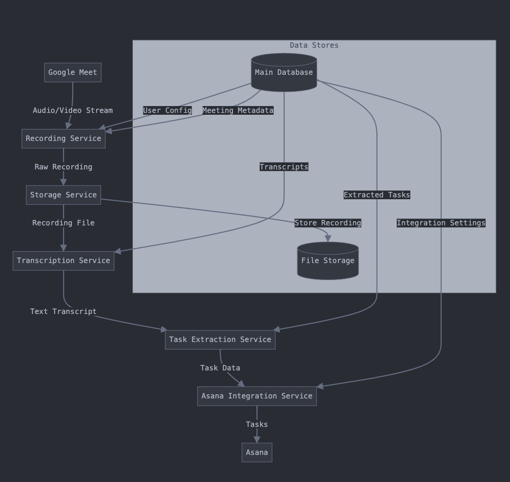
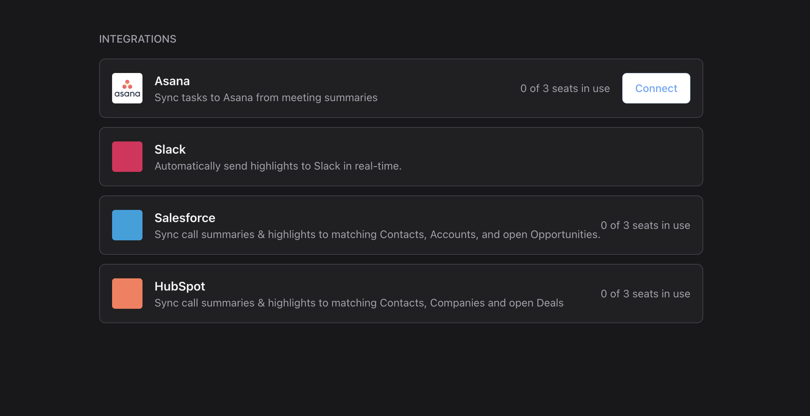

<br/>
<div align="center">
    <a href="https://www.withampersand.com/?utm_source=github&utm_medium=readme&utm_campaign=demo-ticketing&utm_content=logo">
    
    </a>
<br/>
<br/>

<div align="center">

[](https://github.com/amp-labs/connectors) [](https://discord.gg/BWP4BpKHvf) [](https://docs.withampersand.com)  
</div>

</div>

# Ampersand demo app for Ticketing Integrations (Asana, Clickup, Monday.com)

This is a demo app to demonstrate the use of the Ampersand to build an integration use case where we write to ticketing systems such as Asana. 


# Overview 

The app does the following: 
1. Allows your user to connect to their ticketing system of choice (Asana for now). 
2. Exposes an API that accepts tasks that need to sync to the ticketing tool. 


# Architecture 


### This app focuses on the Asana Integration Service that is powered by Ampersand. 




Here we assume you're a meeting recorder that uses AI magic✨ to summarise meetings and syncs the tasks that get identified in the transcriptions to a ticketing tool like Asana. 


# Directory Structure

```
demo-ticketing/
├── client/                     # Frontend React application
│   ├── src/
│   │   ├── components/         # React components
│   │   ├── App.tsx             # Main application component
│   │   └── main.tsx            # Application entry point
│   └── images/                 # Image assets
└── server/                     # Backend application (Express)
    ├── src/
        ├── routes/             # API route handlers
        └── services/           # Business logic and services
```

# Client



To run the client, follow these steps:

1. Navigate to the `client` directory:
   ```sh
   cd client
   ```

2. Install the dependencies:
   ```sh
   yarn install
   ```

3. Run locally: 
    ```sh
    yarn dev
    ```


# Ampersand configuration

The Ampersand configuration is defined in the `amp.yml` file located in the `amp` directory. This file specifies the integrations and their respective settings.


### Ensure the amp configuration is deployed

```sh
amp deploy ./amp --project <YOUR_AMPERSAND_PROJECTID>
```


# Server 


To run the server, follow these steps:

1. Navigate to the `server` directory:
   ```sh
   cd server
   ```

2. Install the dependencies:
   ```sh
   pnpm install
   ```


4. Start the server:
   ```sh
   pnpm start
   ```

5. The server will be running on `http://localhost:4001`.


#### How to use the task creation API 


```sh

POST /api/create-tasks
Content-Type: application/json

{
    "tasks": [
        {
            "title": "Review Q1 metrics",
            "description": "Analyze marketing campaign performance",
            "dueDate": "2025-02-01T00:00:00Z",
            "projectId": "5555555555",
            "tags": ["marketing", "quarterly-review"]
        },
        {
            "title": "Update social media calendar",
            "description": "Incorporate feedback from meeting",
            "dueDate": "2025-02-03T00:00:00Z",
            "projectId": "5555555555",
            "tags": ["social-media"]
        }
    ],
    "workspaceId": "9876543210",
    "assigneeId": "1234567890",
    "meetingId": "123e4567-e89b-12d3-a456-426614174000"
}
```

 Response

```json
{
    "success": true,
    "results": [
        {
            "success": true,
            "taskId": "1234567890",
            "title": "Review Q1 metrics",
            "asanaUrl": "https://app.asana.com/0/0/1234567890"
        },
        {
            "success": true,
            "taskId": "1234567891",
            "title": "Update social media calendar",
            "asanaUrl": "https://app.asana.com/0/0/1234567891"
        }
    ],
    "summary": {
        "total": 2,
        "successful": 2,
        "failed": 0
    }
}
```